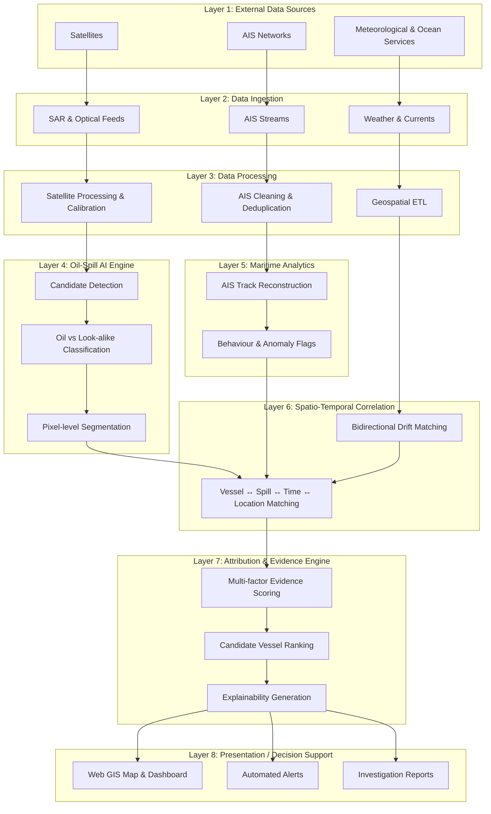
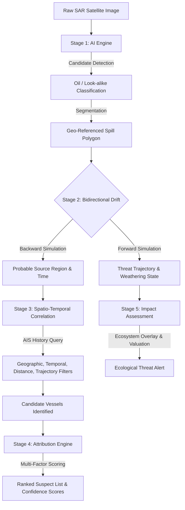
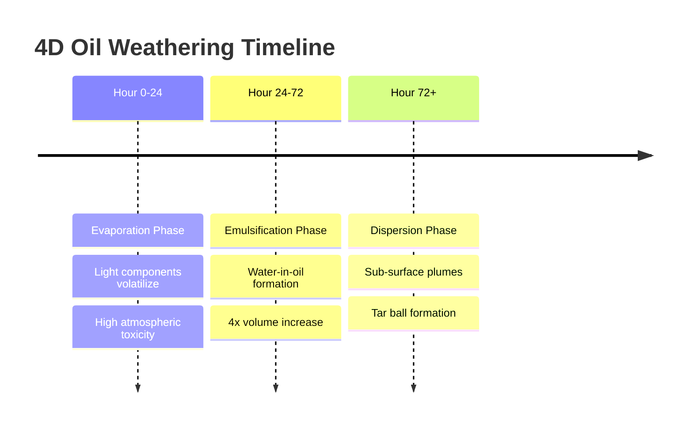

# POSEIDON: AI-Based Oil Spill Detection & Vessel Source Attribution System

**Prototype Submission | Smart India Hackathon 2026**
**Theme:** Space Technology
**Target Agency:** National Technical Research Organisation (NTRO)

---

## 1. EXECUTIVE SUMMARY

**Problem Statement**
Oil spills get detected, but their source rarely does. Coastal agencies can identify a surface slick on a satellite image, but they usually cannot answer which vessel caused it reliably, quickly, or with defensible evidence. The investigative step is currently left entirely to the analyst, as detection tools report a slick, not a suspect.

**Solution Overview**
Poseidon is an AI-assisted maritime intelligence workflow that takes a satellite oil-spill detection and traces it back to the most plausible source vessel. Rather than stopping at a flagged dark patch on a radar image, Poseidon processes data through an 8-layer architecture. Satellite imagery is never wired directly to a vessel name; every inference passes through detection, correlation, and drift modeling before evidence is scored.

[IMAGE: Satellite ocean-colour composite showing a surface slick signature drifting across the Gulf of Mannar toward the Kerala & Sri Lankan coast - the class of event Poseidon is built to detect and trace back to source.]

**Key Innovations**

* **Bidirectional Drift Modeling:** Simulates wind and current data forward and backward in time, turning today's observed slick into a plausible source zone hours earlier.

* **Multi-Factor Evidence Scoring:** Combines spatial, temporal, trajectory, drift-compatibility, and behavioural evidence into one transparent score per candidate vessel.

* **4D Oil Weathering Profiler:** Predicts the chemical state of the oil over time to inform exact cleanup strategies.
* **Blue Carbon Ecosystem Impact Valuation:** Quantifies the economic and ecological threat to vulnerable coastal zones.

**Target Users**
This platform empowers the National Technical Research Organisation (NTRO), the Indian Coast Guard, and coastal state authorities to convert passive monitoring into actionable intelligence.

---

## 2. SYSTEM ARCHITECTURE DIAGRAM

The architecture strictly enforces that data only flows upward, layer by layer, ensuring no shortcut skips a layer. This guarantees that every output is traceable back to the evidence that produced it.

---

## 3. TECHNICAL WORKFLOW

Poseidon translates raw signals into a ranked suspect list. Candidate detection begins with three independent streams that are cleaned separately before they interact.

**Stage 1: AI Engine**

* **Candidate Detection:** Scans the SAR or optical image for suspicious dark regions, removing empty ocean, land, and unrelated clutter.

* **Classification:** Assigns each candidate a single class (e.g., oil, vessel wake, low-wind area, rain cell) to eliminate false positives before segmentation runs.

* **Segmentation:** Produces a pixel-level mask for confirmed candidates using a U-Net/DeepLab-class architecture.

[IMAGE: Real reference product: a NOAA/NESDIS marine-pollution surveillance report generated during the June 2021 X-Press Pearl incident off Colombo, flagging a suspected oil signature on a Pléiades multispectral pass.]

**Stage 2: Bidirectional Drift Modeling**

* **Backward Simulation:** Runs the simulation in reverse from the observed slick to generate the probable source region, which is then used to query AIS history.

* **Forward Simulation:** Starts from a candidate release point and simulates how the slick will spread over a 48-hour period.

[IMAGE: Real case reference the X-Press Pearl sinking (May 2021, off Colombo): panel A shows the vessel's actual route into the incident; panel B shows the post-spill nurdle/debris trail carried south by the monsoon current.]

**Stage 3: Spatio-Temporal Correlation**

* **AIS History Query:** The system queries historical AIS tracks against the estimated source zone and time window.

* **Filters:** Geographic, temporal, distance, and trajectory filters shrink the search space before attribution.

**Stage 4: Attribution Engine**
Treating the nearest ship on the map as the answer produces false accusations. Poseidon assigns an association score using multi-factor evidence ranking.

| Evidence Category | Weight | Description |
| --- | --- | --- |
| **Spatial proximity** | 25% | Vessel located within the estimated source region.

 |
| **Temporal correlation** | 20% | Vessel present during the correlated time window.

 |
| **Trajectory intersection** | 20% | Historical track intersects the probable source zone.

 |
| **Drift-model compatibility** | 20% | Backward-simulated drift is compatible with the detected slick.

 |
| **Behavioural evidence** | 10% | Unusual speed reduction or unexplained route deviation.

 |
| **Historical context** | 5% | Previous vessel history flags.

 |

[IMAGE: Bar chart showing evidence weighting: Spatial proximity 25%, Temporal correlation 20%, Trajectory intersection 20%, Drift-model compatibility 20%, Behavioural evidence 10%, Historical context 5%.]

**Stage 5: Impact Assessment**

* Overlays the forward trajectory on Blue Carbon ecosystems.
* Calculates a vulnerability score and generates an economic damage estimate.

---

## 4. NEW FEATURES

**Feature 1: 4D Oil Weathering Profiler**

* **Problem:** Oil physically and chemically changes over time; it does not merely move.
* **Solution:** Integration of the OpenOil module to simulate the chemical weathering of the slick.
* **Technical Details:**
* **Evaporation (Hours 0-24):** Light components volatilize, reducing surface volume.
* **Emulsification (Hours 24-72):** Water mixes into the oil to form a viscous mousse, increasing volume up to 4x.
* **Dispersion:** Wave action breaks surface oil into sub-surface plumes.
* **Surface Retention:** Calculates the exact volume remaining for physical skimming.

* **Operational Value:** Informs the Coast Guard whether to deploy skimmers, dispersants, or shoreline barriers.

**Feature 2: Blue Carbon & Bio-Economic Damage Valuation**

* **Problem:** Authorities need quantified impact data to justify emergency response funding.
* **Solution:** GeoJSON overlay of critical Indian marine ecosystems intersecting with the forward-drift trajectory.
* **Data Layers:** Marine Protected Areas (Gulf of Mannar, Sundarbans, Lakshadweep), Commercial fishing zones (CMFRI sectors), and Blue carbon ecosystems (mangroves, coral reefs).
* **Vulnerability Scoring Algorithm:**
`Score = (Area_Impacted × Ecosystem_Value × Oil_Toxicity) / Time_to_Impact`

| Ecosystem Type | Value Weight | Description |
| --- | --- | --- |
| Coral Reefs | 10 | Decades to recover; high biodiversity loss. |
| Mangroves | 8 | Severe impact on blue carbon storage. |
| Fishing Zones | 6 | Direct economic loss to coastal communities. |
| Open Ocean | 1 | Baseline impact; high dispersion rate. |

* **Output Example:** "CRITICAL ALERT: 23 km² slick will impact Sector 4 Fishing Zone in 14 hours. Threat: Severe. Economic value: ₹47 crore. Recommended: Deploy dispersants, notify 12 villages."

[IMAGE: Current oil spill flow map 2023 vs Oil spill flow map (2017). Flow-path reconstructions along the CPCL/Ennore Creek stretch of coast.]

**Feature 3: Cryptographic Evidence Locker**

* **Problem:** Maritime courts require a tamper-proof chain of custody for digital evidence.
* **Solution:** Automated SHA-256 hash generation for all incident data.
* **Process:** When attribution confidence exceeds 90%, the system automatically generates cryptographic hashes for the SAR image metadata, AIS track logs, and drift model parameters. These are compiled into a timestamped PDF evidence package.
* **Legal Value:** Guarantees data integrity for successful prosecution.

---

## 5. IMPLEMENTATION DETAILS

A prototype stack chosen for speed of implementation within the hackathon window, featuring a clear upgrade path rather than premature complexity.

| Component | Technology Choice |
| --- | --- |
| **Frontend** | React / Next.js, MapLibre GL, Leaflet

 |
| **Backend & AI** | Python FastAPI, PyTorch, OpenCV, Rasterio, GDAL, GeoPandas, Shapely

 |
| **Drift Engine** | OpenDrift / OpenOil |
| **Database** | PostgreSQL + PostGIS

 |
| **Data Sources** | Sentinel-1 SAR, AIS feeds, ECMWF weather, Copernicus Marine currents

 |
| **APIs** | RESTful endpoints for `/detect`, `/correlate`, `/attribute`, `/forecast` |

---

## 6. IMPACT METRICS

* **Environmental:** Faster, more precise slick detection and extent estimation supports quicker containment decisions and reduces coastal ecological damage.

* **Security:** Converts passive monitoring into an intelligence product supporting enforcement, coastal-security response, and diplomatic follow-up.

* **Legal:** Every score ships with a reproducible, plain-language evidence trail, recording the model version, inputs, and configuration.

* **Economic:** Quantified damage estimates enable emergency funding justification.
* **Learning:** Analyst-reviewed false positives and confirmed detections feed back into the training set for human-in-the-loop continuous improvement.

---

## 7. FEASIBILITY & DEMO SCOPE

Poseidon is proposed as a working prototype, sized to be demonstrable within the hackathon timeline.

* **Demo Scenario:** Focuses on a single region (e.g., Gulf of Mannar), evaluating one historical spill event against 3-5 candidate vessels.

* **Data Availability:** Public Sentinel-1 SAR oil-spill datasets and open AIS feeds are sufficient to demonstrate the pipeline without needing classified inputs.

* **Accuracy Story:** Reports honest detection precision/recall bands against a labelled SAR validation set rather than a single unqualified number.

* **Scalability Path:** The prototype utilizes FastAPI and PostGIS; the scale-up path for production includes Kafka streaming, Docker + Kubernetes, and GPU inference clusters.

---

*Document Version: 2.0 - Enhanced with Weathering & Impact Assessment*
